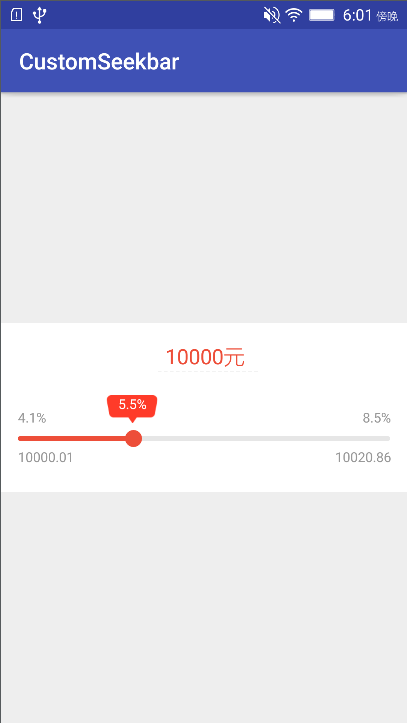

# CustomSeekbar
有泡泡提示的Seekbar

# 效果图

# 使用方式
1、xml配置：

	<com.xyzlf.seekbar.lib.CustomSeekbar
        android:id="@+id/seek_bar"
        android:layout_width="match_parent"
        android:layout_height="wrap_content"
        android:layout_centerInParent="true"
        android:background="#ffffff"
        android:max="100"
        android:maxHeight="4dp"
        android:minHeight="4dp"
        android:progress="0"
        android:progressDrawable="@drawable/seekbar_bg"
        android:thumb="@drawable/seakbar_thumb"/>

2、代码使用

	CustomSeekbar customSeekBar = (CustomSeekbar) findViewById(R.id.seek_bar);
    customSeekBar.setLable("10000元", "10000.01", "10020.86", "4.1%", "8.5%", "5.5%");
    customSeekBar.setMax(100);

    int initProgress = (int) ((0.055  - 0.041) / (0.085 - 0.041) * 100);
    customSeekBar.setProgress(initProgress);
    customSeekBar.setOnSeekBarChangeListener(new SeekBar.OnSeekBarChangeListener() {
        @Override
        public void onProgressChanged(SeekBar seekBar, int progress, boolean b) {
            double seekbarProfit = 4.1 + progress * (8.5-4.1) / 100;
            String floatProfitStr = String.format(Locale.CHINA,"%.1f", seekbarProfit) + "%";
            customSeekBar.setFloatProfit(floatProfitStr);

            customSeekBar.setTransferMoney(String.format(Locale.CHINA,"%.2f元", 10000 + 10000 * seekbarProfit / 365 / 100));
        }

        @Override
        public void onStartTrackingTouch(SeekBar seekBar) {

        }

        @Override
        public void onStopTrackingTouch(SeekBar seekBar) {

        }
    });

# 相关资料

1、自定义SeekBar，进度变化由可视化气泡样式呈现：<https://github.com/woxingxiao/BubbleSeekBar>

2、rubensousa/PreviewSeekBar：<https://github.com/rubensousa/PreviewSeekBar>

# 关于我
有任何使用问题，可以给我发邮件：

Author：张利峰

E-mail：519578280@qq.com

# License

    Copyright(c)2017 xyzlf Open Source Project

    Licensed under the Apache License, Version 2.0 (the "License");
    you may not use this file except in compliance with the License.
    You may obtain a copy of the License at

    http://www.apache.org/licenses/LICENSE-2.0

    Unless required by applicable law or agreed to in writing, software
    distributed under the License is distributed on an "AS IS" BASIS,
    WITHOUT WARRANTIES OR CONDITIONS OF ANY KIND, either express or implied.
    See the License for the specific language governing permissions and
    limitations under the License.